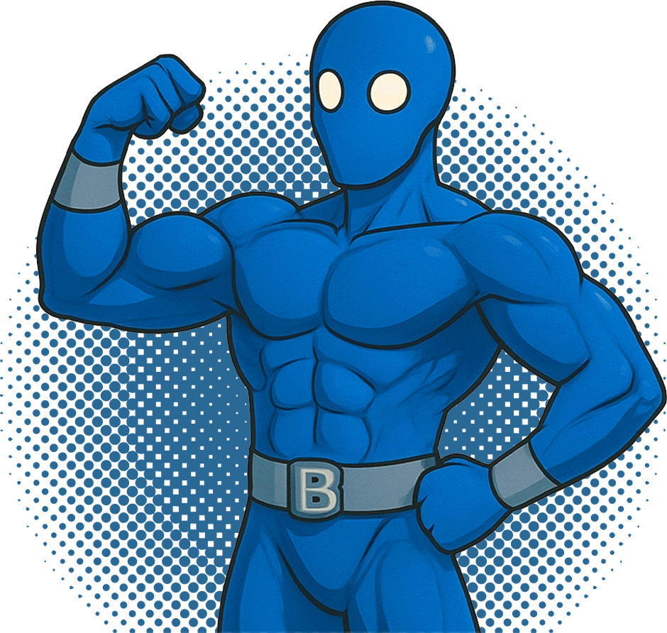

# Инструкция по замене изображений

## 📁 Где загружать изображения

Загрузите ваши изображения в папку:
```
/Users/imax/Local Sites/workoutbroclub/landing/images/
```

## 🖼️ Необходимые изображения

### 1. Логотип (logo-icon.png)
- **Размер**: 40x40px или больше
- **Формат**: PNG с прозрачным фоном
- **Заменит**: 👽 в header
- **Строка в HTML**: 17

### 2. Главный персонаж (character.png)
- **Размер**: 200x200px или больше
- **Формат**: PNG с прозрачным фоном
- **Заменит**: 💪 в hero секции
- **Строка в HTML**: 51

### 3. Папка (folder.png)
- **Размер**: 150x150px или больше
- **Формат**: PNG с прозрачным фоном
- **Заменит**: 📁 в секции "Что внутри"
- **Строка в HTML**: 85

### 4. Закрытая папка (locked-folder.png)
- **Размер**: 150x150px или больше
- **Формат**: PNG с прозрачным фоном
- **Заменит**: 🔒 в секции эксклюзивного контента
- **Строка в HTML**: 144

### 5. Аватары для отзывов
- **avatar1.png** (60x60px) - Michael R.
- **avatar2.png** (60x60px) - Anna S.
- **avatar3.png** (60x60px) - Dmitry K.
- **Формат**: PNG или JPG
- **Заменит**: 👨, 👩, 👨 в отзывах

## 🔄 Как заменить изображения

### Шаг 1: Загрузите файлы
Скопируйте ваши изображения в папку `images/` с указанными именами.

### Шаг 2: Обновите HTML
Замените эмодзи на теги `` в файле `index.html`:

**Пример замены логотипа:**
```html
<!-- БЫЛО: -->
<div class="logo-icon">👽</div>

<!-- СТАЛО: -->

```

**Пример замены персонажа:**
```html
<!-- БЫЛО: -->
<div class="character">💪</div>

<!-- СТАЛО: -->

```

### Шаг 3: Обновите CSS (если нужно)
Если ваши изображения имеют другие размеры, обновите CSS в файле `styles.css`:

```css
.logo-icon {
    width: 40px;
    height: 40px;
    /* Добавьте если нужно: */
    /* object-fit: cover; */
}

.character {
    width: 200px;
    height: 200px;
    /* Добавьте если нужно: */
    /* object-fit: contain; */
}
```

## 📝 Быстрая замена (автоматическая)

После загрузки всех изображений, выполните поиск и замену в HTML файле:

1. **Логотип**: Замените `<div class="logo-icon">👽</div>` на ``

2. **Персонаж**: Замените `<div class="character">💪</div>` на ``

3. **Папка**: Замените `<div class="folder-icon">📁</div>` на ``

4. **Закрытая папка**: Замените `<div class="locked-folder">🔒</div>` на ``

5. **Аватары**: Замените каждый `<div class="testimonial-avatar">👨</div>` на соответствующий ``

## ✅ Проверка

После замены:
1. Откройте `index.html` в браузере
2. Убедитесь, что все изображения загружаются корректно
3. Проверьте адаптивность на разных размерах экрана
4. Протестируйте переключение языков

## 🎨 Рекомендации по дизайну

- **Цветовая схема**: Используйте синие тона (#0066ff, #00aaff) для соответствия дизайну
- **Стиль**: Современный, минималистичный дизайн
- **Качество**: Высокое разрешение для четкости на Retina дисплеях
- **Формат**: PNG для изображений с прозрачностью, JPG для фотографий
